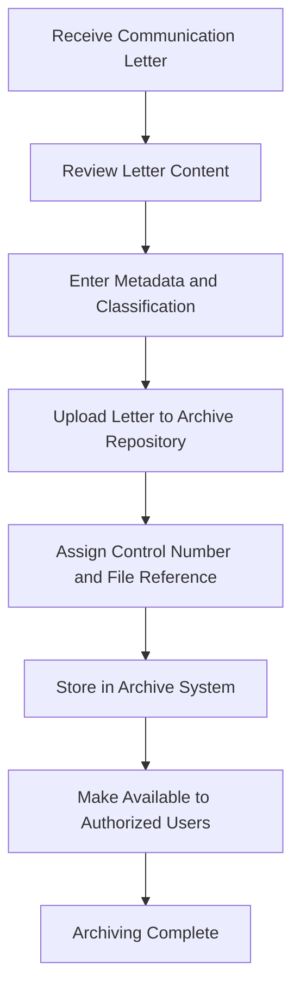

# Chapter III: Operational Framework

## Materials

### Software

#### Backend Framework & Runtime
- **Django** (≥5.0, <6.0)
  - Web application framework for Python
  - Handles routing, views, models, and ORM
  - Provides built-in admin panel and security features

- **Python** (3.8+)
  - Server-side programming language
  - Runtime environment for Django application

- **PostgreSQL** (Optional, Production)
  - Relational database management system
  - Configured via environment variables (DB_NAME, DB_USER, DB_PASSWORD, DB_HOST, DB_PORT)
  - Default: Port 5432

- **SQLite3** (Development Default)
  - Lightweight embedded database
  - Used when DB_NAME environment variable is not set
  - File-based: `db.sqlite3`

#### Python Dependencies
- **Pillow** (≥10.0)
  - Image processing library
  - Used for document scan uploads and image handling
  - Supports various image formats for archiving

- **psycopg[binary]** (≥3.1)
  - PostgreSQL adapter for Python
  - Enables connection to PostgreSQL databases
  - Binary package for easier installation

- **python-dotenv** (≥1.0)
  - Environment variable management
  - Loads configuration from `.env` file
  - Keeps sensitive data secure (SECRET_KEY, database credentials)

#### Frontend
- **HTML5** with Django Template Engine
  - Server-side rendering
  - Responsive design using CSS

- **CSS3** (`static/css/app.css`)
  - Styling and layout
  - Theme support (light/dark mode toggle)

- **JavaScript** (Vanilla)
  - `notifications.js` - Real-time notification handling
  - `password-toggle.js` - Password field visibility toggle
  - `theme-toggle.js` - Dark/light theme switching

#### Development Tools & Testing
- **Django Test Framework**
  - Unit and integration testing
  - Covers: series numbering, role boundaries, confidential record visibility, search filters, soft delete
  - Command: `python manage.py test`

#### Security & Environment
- **Django Security Middleware**
  - CSRF protection
  - Click-jacking prevention
  - Session management
  - Authentication system

- **Role-Based Access Control (RBAC)**
  - Two roles: Administrator and Staff User
  - Enforced via `accounts/mixins.py`
  - Superuser support for elevated privileges

---

### Hardware

#### Server Infrastructure
- **Development Server**
  - CPU: Minimum 2 cores (Intel i5 or equivalent)
  - RAM: 4GB minimum (8GB recommended)
  - Storage: 20GB minimum for OS, application, and media files
  - Operating System: Windows, macOS, or Linux

- **Production Server**
  - CPU: Minimum 4 cores (Intel Xeon or equivalent)
  - RAM: 8GB minimum (16GB or more recommended for concurrent users)
  - Storage: 
    - 50GB+ SSD for application and database
    - Additional NAS/SAN for document archiving (depends on volume)
  - Network: Gigabit Ethernet minimum
  - Backup: Redundant storage system (RAID configuration recommended)

#### Database Server
- **PostgreSQL Server** (Production)
  - CPU: Dedicated or shared virtual cores
  - RAM: 4GB minimum (8GB+ for large datasets)
  - Storage: 
    - 100GB+ SSD for database files
    - Daily backup storage (external/cloud)
  - Network: Dedicated connection to application server

#### Client Hardware
- **Administrator Workstations**
  - CPU: Dual-core minimum (modern processor)
  - RAM: 4GB minimum (8GB recommended)
  - Storage: Local or network storage for temporary files
  - Display: Dual monitor setup recommended
  - Network: Stable internet connection (broadband minimum)

- **Staff User Workstations**
  - CPU: Single-core minimum (modern processor)
  - RAM: 2GB minimum (4GB recommended)
  - Storage: Minimal local storage
  - Display: Single monitor acceptable
  - Network: Stable internet connection (broadband minimum)

#### Network Infrastructure
- **Web Server Host**
  - Firewall with port filtering (HTTP: 80, HTTPS: 443)
  - Load balancer (optional, for high availability)
  - SSL/TLS certificates for secure connections

- **Network Bandwidth**
  - Upload/Download: 100 Mbps minimum for document uploads
  - Latency: <50ms for optimal user experience

#### Storage Systems
- **Local Storage**
  - Media directory: `media/archive/<year>/<type>/<uuid>.<ext>`
  - Attachments: `media/attachments/<year>/<uuid>.<ext>`
  - Import staging: `media/imports/<year>/<month>/<uuid>.csv`
  - Scan staging: `media/scan-staging/<batch>/<uuid>.<ext>`

- **Backup Storage**
  - External HDD or NAS for daily incremental backups
  - Cloud storage (AWS S3, Azure Blob Storage) optional for disaster recovery
  - Retention: Minimum 30 days for rollback capability

#### Peripheral Devices
- **Document Upload Source** (Optional)
  - Supports image or PDF files for archiving
  - Compatible with standard office document formats

- **Network Printer** (Optional)
  - For printed archive records and exports

---

## System Environments

### Development Environment
- **Setup**
  ```bash
  python -m venv .venv
  source .venv/bin/activate  # Windows: .venv\Scripts\activate
  pip install -r requirements.txt
  cp .env.example .env
  ```
- **Database**: SQLite3 (`db.sqlite3`)
- **Server**: Django development server (http://127.0.0.1:8000/)
- **Debug Mode**: Enabled

### Testing Environment
- **Framework**: Django Test Framework
- **Database**: In-memory SQLite or test database
- **Coverage**: Series numbering, RBAC, confidential records, search filters, soft delete

### Staging Environment
- **Database**: PostgreSQL (separate instance)
- **Server**: Production-like setup with limited users
- **SSL**: Enabled with valid certificates

### Production Environment
- **Database**: PostgreSQL (dedicated server or managed service)
- **Server**: 
  - Gunicorn or uWSGI application server
  - Nginx or Apache reverse proxy
  - WSGI application: `config.wsgi.application`
- **SSL**: Enforced HTTPS with valid certificates
- **Debug Mode**: Disabled
- **Logging**: Comprehensive audit trail stored in database

---

## Data Management

### Record Types
1. **Memorandum** (MEMO)
2. **Indorsement** (IND)
3. **Office Order** (OO)
4. **Executive Order** (EO)

### Record Classification
- **Public**: Accessible to all users
- **Internal**: Accessible to staff and administrators
- **Confidential**: Administrators only

### Record Status
- **ACTIVE** - In effect
- **SUPERSEDED** - Replaced by newer record
- **REVOKED** - Canceled/reversed
- **ARCHIVED** - Closed and archived

### Control Numbering
- Format: `TYPE No. NNN, s. YEAR`
- Example: `MEMORANDUM No. 012, s. 2026`
- Numbering: Independent per type, per series year
- Soft delete: Numbers remain reserved

### Audit Trail
- **Logged Activities**
  - User sign-ins
  - Document searches
  - Document views
  - File downloads
  - Document edits
  - Account changes
  - Denied access attempts

- **Log Fields**
  - User ID/username
  - Timestamp (with timezone)
  - IP address
  - Action type
  - Resource affected
  - Status (success/failure)

- **Access**: Read-only, even in Django admin

---

## Access & Deployment

### Program Flowchart for Communication Letter
The communication letter workflow is centered on archiving documents rather than tracking them. Once a letter is received, it is reviewed, classified, stored in the archive repository, and made available to authorized users.



### Communication Channels
- **HTTP/HTTPS**: Web interface at domain/IP
- **Email**: For password resets and notifications (optional)
- **Archive Access**: Secure retrieval and viewing of stored letters

### Planning
- **User Roles**: Two-tier system (Admin/Staff)
- **Workflow**: File → Edit → Supersede/Revoke → Archive
- **Backup Strategy**: Daily incremental backups

### Modeling
- **Data Model**: Documents, Attachments, AccessLog
- **Relationships**: 
  - Indorsements → Parent Documents
  - Superseded Orders → Previous Orders
  - Attachments → Documents

### Construction
- **Framework**: Django with PostgreSQL
- **Architecture**: MTV (Model-Template-View)
- **Testing**: Comprehensive test coverage

### Deployment
- **Version Control**: Git-based deployment
- **Migrations**: `python manage.py makemigrations` & `migrate`
- **Static Files**: Collected via `collectstatic`
- **Media Files**: Served via dedicated media server or CDN
- **Environment**: `.env` file for configuration

### Evaluation
- **Performance Metrics**
  - Page load time: <2 seconds
  - Search response: <1 second
  - Concurrent users: Configurable via server capacity
  
- **Security Audits**
  - Regular penetration testing
  - Dependency vulnerability scanning
  - Access log review
  
- **Maintenance**
  - Django/Python updates
  - Database optimization
  - Backup verification

---

## Summary Table

| Component | Type | Specification | Notes |
|-----------|------|---------------|-------|
| **Backend** | Software | Django 5.0+, Python 3.8+ | Core framework |
| **Database** | Software/Hardware | PostgreSQL or SQLite | Production uses PostgreSQL |
| **Image Processing** | Software | Pillow 10.0+ | Document/attachment handling |
| **Server OS** | Hardware | Windows/Linux/macOS | Any modern OS |
| **CPU** | Hardware | 2-4 cores min. | Development: 2, Production: 4+ |
| **RAM** | Hardware | 4-8GB (Dev), 8-16GB+ (Prod) | Depends on user load |
| **Storage** | Hardware | 20GB+ (Dev), 50GB+ (Prod) | Plus archival media capacity |
| **Database Storage** | Hardware | SSD, 100GB+ (Prod) | RAID recommended |
| **Network** | Hardware | 100 Mbps min. | For document uploads |
| **Backup Storage** | Hardware | External/NAS/Cloud | 30+ day retention |
